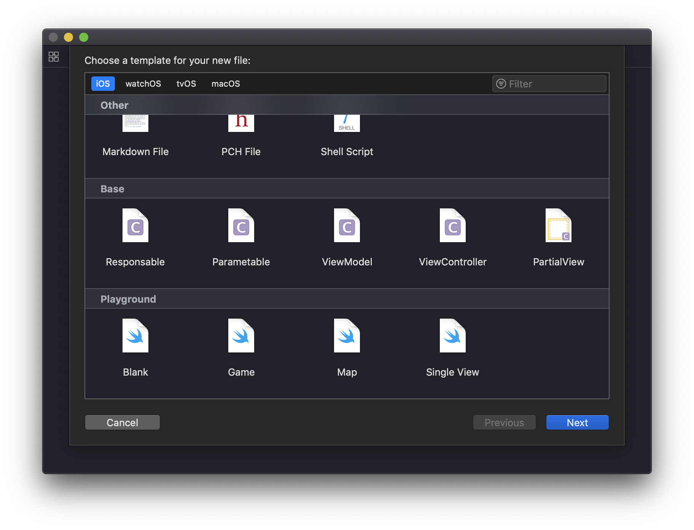

[]()
[](https://github.com/markgravity/base/blob/master/LICENSE)


## Features

- Support functions to write Api & validate parameters
- Easlity to create a Popup from a xib file
- Provides MVVM protocol, extensions
- Authentication 
- Extensions
- Custom Segues
- Misc
- Xcode Templates for Base

## Installation

### CocoaPods

Add the following entry to your Podfile:

```
pod 'Base', :git => "https://github.com/markgravity/base.git"
```

Then run `pod install`.

Don't forget to `import Base` in every file you'd like to use Base.

#### Xcode Templates

- Open Terminal.app

- On the command line, `cd` into the `Base` directory and run `./install_xcode_templates.sh`

- Restart Xcode, enjoy

  

## Documentations

Checkout the **[WIKI PAGES (Usage Guide)](https://github.com/markgravity/base/wiki)** for documentations.